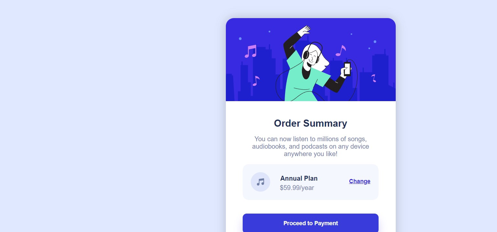

# FrontEndProjects
## Repository presentation
***English***

Hello !

The main goal of this repository is to share my differentes front-end projects. 
The majority of my projects are solutions of challenges carried out on the site <https://www.frontendmentor.io>.
So, I propose solutions to these challenges.
For each challenge, there will be the link of the challenge (if it is) and of the repository of it.
Feel free to advise me on how to improve my code (or maybe, how to improve my english) !

***Français***

Bonjour !

Le principal but de ce dépot est de partager mes differents projets front-end.
La majorité de mes projets sont des challenges effectués sur le site <https://www.frontendmentor.io>.
Donc je propose des solutions à ces challenges.
Pour chaque challenge, il y aura le lien du challenge (si s'en est un) et de son dépot.
N'hésitez pas à me conseiller sur la façon d'améliorer mon code !

## Table of Contents

| Difficulty | Name of the challenge                                                |
| ---------- | --------------------------------------------------------------------- |
| NEWBIE     | [Order Summary Component](#order-summary-component)                   |

## Order Summary Component

### Screenshot

### Links

- Repository URL : <https://github.com/FortisCodis/P1--order_summary_component>
- Live site URL : <https://fortiscodis.github.io/P1--order_summary_component/>
- Challenge URL : <https://www.frontendmentor.io/challenges/order-summary-component-QlPmajDUj> 
